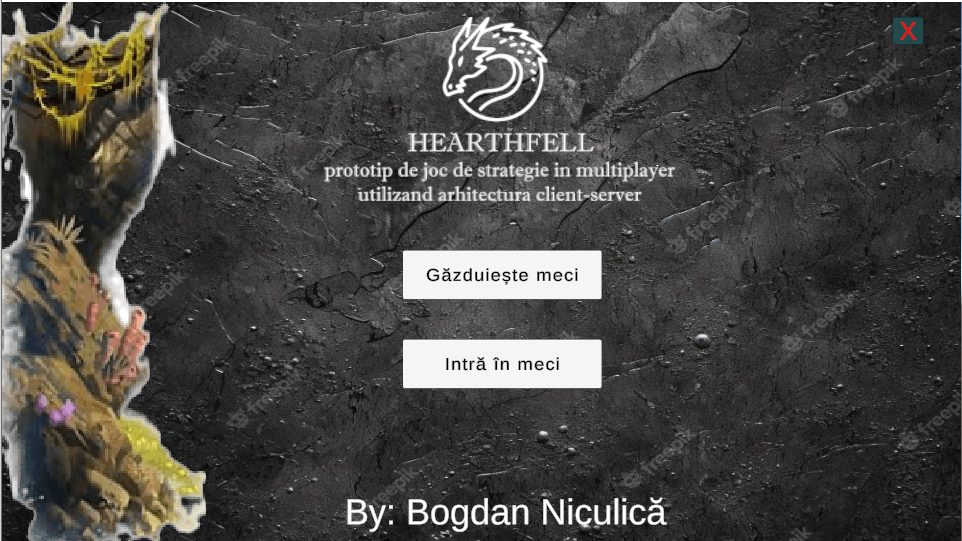
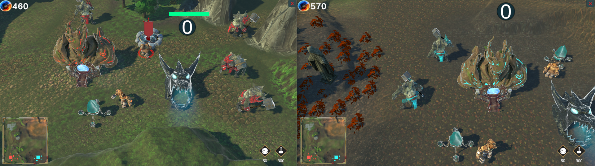
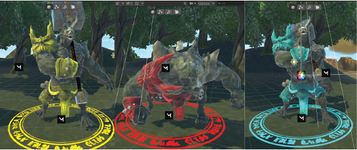
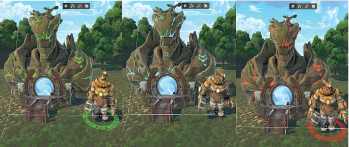
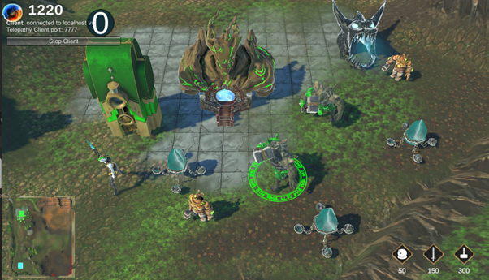

# Unity-multiplayer-RTS-prototype
Prototip de joc de strategie creat cu Unity si framework-ul Mirror. Aplicatia poate rula in LAN sau prin Hamachi.

Proiectul are ca obiectiv final crearea unui joc de strategie multiplayer care va fi realizat în motorul de joc Unity, împreună cu biblioteca Mirror pentru realizarea componentei de multiplayer. Pentru realizarea acestei aplicații complexe, au fost aplicate cunoștințe software atât teoretice cât și practice, dar și o abordare creativă și dinamică.
În realizarea lucrării au fost sintetizate componentele de bază ale unui joc de strategie comercial: colectarea și generarea de resurse, antrenarea unor luptători cu o tematică vizuală specifică din lumea jocului, capabili să combată și să atace forțele celorlalți jucători, construirea unor clădiri cu ajutorul unor entități de tip constructori de unde vor fi recrutați luptătorii respectivi și asignarea fiecărei unități a unui jucător în parte cu o culoare specifică echipei din care face parte.

https://github.com/Bogadan/Unity-multiplayer-RTS-prototype/assets/139983368/c58255ea-6cc0-49a3-9636-50d0bc8315e0

